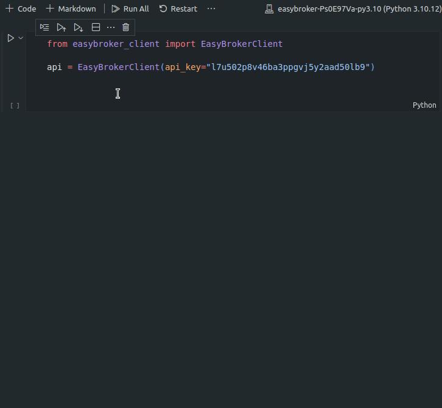

# EasyBroker Client

Using the programming language of your choice, create a class that consumes the EasyBroker API to read all the properties of our staging account and print their titles. Include at least one unit test and send us your code as a gist.

Staging account documentation and credentials are available at: https://dev.easybroker.com/docs.

## My solution:

I created this nice API client called `EasyBrokerClient`, which aims to be versatile, generic, easily extensible, intuitive and semantic. It can do a lot of things besides the asked challenge.

Btw, the solution is in the `main.py` file, but the interesting part is in the other files (including the tests, check it out).

```python
from easybroker_client import EasyBrokerClient

client = EasyBrokerClient(api_key=API_KEY)

# Action: GET to https://api.stagingeb.com/v1/properties
# Result: requests.Response
client.properties.get()

# Action: GET to https://api.stagingeb.com/v1/properties?page=1&limit=5"
# Result: requests.Response
client.properties.get(params={"page": 1, "limit": 5})

# Action: GET to https://api.stagingeb.com/v1/properties?page=1&limit=5&search[property_types][]=apartment&search[min_price]=10000
# Result: requests.Response
client.properties.get(params={
    "page": 1,
    "limit": 5,
    "search[property_types][]": "apartment",
    "search[min_price]": 10000,
})

# Action: POST a JSON body to https://api.stagingeb.com/v1/properties
# Result: requests.Response
client.properties.post(json={"property_type": "House", ... })

# Action: GET to https://api.stagingeb.com/v1/properties/EB-D8514
# Result: requests.Response
client.properties.get('EB-D8514')

# Action: GET to https://api.stagingeb.com/v1/properties/EB-D8514
# Result: JSON
client.properties.get('EB-D8514', raw=False)

# it's the same than the last request...
# Action: GET to https://api.stagingeb.com/v1/properties/EB-D8514
# Result: JSON
client.properties.find('EB-D8514')

# Action: GET to https://api.stagingeb.com/v1/integration_partners/agencies
# Its not possible to request it with the api key from testing.
client.partners.agencies.get(headers={"Country-Code": "AR"})

# Action: PATCH to https://api.stagingeb.com/v1/integration_partners/properties/{property_id}/property_integration
# Its deprecated... but it was an interesting case, so I decided to implement it.
client.partners.properties.path_param(42).property_integration.patch()
```

Because this will be sent as a gist, the project may look a little disorganized. Sorry about that.

To add a new resource or endpoint, its possible to do it at `easybroker_client.py`. Just add a new `WrappedResource` instance at the right level. For example, at root level:

```python
# https://api.stagingeb.com/v1/sales
sales: Resource = WrappedResource("sales")
setattr(EasyBrokerClient, 'sales', sales)
```

Or including an already existing URI, as a subresource:

```python
# https://api.stagingeb.com/v1/integration_partners/sales
sales: Resource = WrappedResource("sales")
integration_partners: Resource = WrappedResource(
    "integration_partners",
    subs=[
        sales,  # <-- added
        agencies,
        agents,
        partners_contact_requests,
        partners_listing_statuses,
        partners_properties])
```

It's a shame that IDE autocomplete doesn't show dynamically generated attributes, but it's nothing that with a little work of stub files it could not be achieve. An alternative could be to implement it with concrete classes, but there would be too many and they would all be too similar... So I chose this approach. The stub files stuff will be a future work.

But, good news... Jupyter Notebooks can autocomplete methods after instantiate a dynamic class! Check the next video, when I tried to got some autocompletition over the `partners` method, it didin't work until I run the code block and saved it at the `api` variable (the same happened with the `property_integration` method).



It's because the `__dir__` attribute is populated with the dynamic methods in runtime, at instance creation, and Notebooks uses this to improve its autocompletition...

> Enjoy!